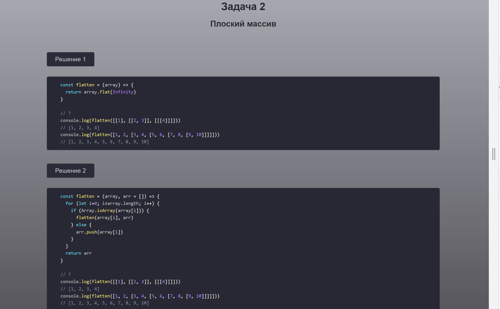

# JavaScript-tasks

Публичный адрес сайта: [https://artgroupwhitebox.github.io/JavaScript-tasks/](https://artgroupwhitebox.github.io/JavaScript-tasks/)

## Решаем задачи на JavaScript

## Описание
На сайте собраны различные задачи для самостоятельного решения на языке программирования JavaScript. 
По каждой задаче приведено одно или несколько вариантов решений 

## Идея
Сайт для новичков, которые хотят прокачать свои навыки или проверить уровень знаний в алгоритмах и нативном JS

## Развитие приложения
Новые темы, задачи и решения будут периодически добавляться на сайт.
Следите за обновлениями!

## Технологии
JS, AJAX, CSS, HTML

## Функционал приложения

#### Список задач по различным темам

#### Описание задачи

#### Решение задачи или несколько решений, которые можно открыть все одновременно, для сравнения вариантов

## Запуск приложения

1. Установить плагин для сервера в редакторе кода. Например, для VSCode - ссылка для установки LiveServer
    [https://marketplace.visualstudio.com/items?itemName=ritwickdey.LiveServer](https://marketplace.visualstudio.com/items?itemName=ritwickdey.LiveServer)
    Сервер необходим, так как приложение использует AJAX запросы

2. Запустить файл <>index.html в браузере

## PS

Если решите какую-либо задачу другим способом, можете создать для меня Pull request
